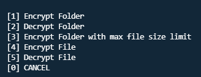

# AES-256-encrypter
A simple node js encrypter/decrypter powered by aes 256 bit

## How to run?
```
git clone https://github.com/AdityaXJha/AES-256-encrypter
```
```javascript
npm install
npm start
```
***
### You can select these options from Terminal - 


> Make sure you have nodejs installed 
